# 🍽️ Recipe Sharing API

A secure and scalable RESTful API built using **Django** and **Django REST Framework (DRF)**. This project allows users to create, manage, and explore recipes with image uploads, category organization, search and filtering features, and email notifications.


---

# 🚀 Features

- 🔐 **User Authentication (JWT)**
  Secure login and registration system using JSON Web Tokens. Only authenticated users can create, update, or delete recipes.

- 🍲 **Recipe Management (CRUD)**
  Users can create, view, update, and delete their own recipes.

- 🗂️ **Category Management (CRUD)**
  Recipes can be organized into different categories like breakfast, lunch, dessert, etc.

- 🖼️ **Recipe Image Upload**
  Users can upload images for recipes using multipart/form-data. Images are stored in the media directory.

- 🔍 **Search Recipes**
  Search recipes by title using DRF search functionality.
  Example:

GET /api/recipes/?search=momo


- 🎯 **Filter Recipes by Category**
Easily filter recipes based on category.

GET /api/recipes/?category=2


- 📧 **Email Notification**
Sends a confirmation email to the user after successfully creating a recipe using Gmail SMTP.

- 📄 **Swagger API Documentation**
Automatically generated API documentation using **drf-yasg**.

- 📘 **ReDoc Documentation**
Alternative clean documentation UI for API endpoints.

- 🎨 **Jazzmin Admin Panel**
Enhanced Django admin interface for better UI/UX.

- ⚙️ **Environment Variable Support**
Sensitive data like SECRET_KEY and EMAIL credentials are managed using `.env`.

- 🔒 **Permission Control**
Only recipe owners can update or delete their recipes.

---

## Environment Variables

Create a .env file in the project root.

Example:

SECRET_KEY=your_secret_key
DEBUG=True

EMAIL_HOST=smtp.gmail.com
EMAIL_PORT=587
EMAIL_HOST_USER=your_email@gmail.com
EMAIL_HOST_PASSWORD=your_gmail_app_password
EMAIL_USE_TLS=True
DEFAULT_FROM_EMAIL=your_email@gmail.com

## Database Setup

Run migrations.

python manage.py makemigrations
python manage.py migrate

Create a superuser.

python manage.py createsuperuser

## Run the Development Server
python manage.py runserver

The application will be available at:

http://127.0.0.1:8000/

# 🏗️ Django REST Framework Architecture

Client  
(e.g., Browser, Swagger UI)

↓

URL Router (`urls.py`)  
Routes incoming HTTP requests to the appropriate ViewSet.

↓

ViewSet  
Contains business logic, handles permissions, interacts with serializers and models.

↓

Serializer  
Validates input data and converts Python objects ↔ JSON.

↓

Model  
Defines database structure using Django ORM.

↓

Database  
Stores users, recipes, categories, images, and related data.

↓

JSON Response  
Final response sent back to the client.

---

# ⚙️ CRUD Operations using ModelViewSet

This project uses DRF's `ModelViewSet` for both recipes and categories.

```python
class RecipeViewSet(viewsets.ModelViewSet):
  ...
  
class CategoryViewSet(viewsets.ModelViewSet):
  ...

```
# 🔑 Authentication

This project uses JWT Authentication.

## Obtain Token

```http
POST /api/token/
```

Request:

```json
{
    "username": "your_username",
    "password": "your_password"
}
```
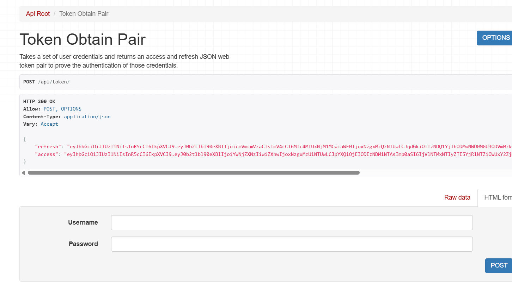

Response:

```json
{
    "refresh": "your_refresh_token",
    "access": "your_access_token"
}
```

---

## Refresh Token

```http
POST /api/token/refresh/
```

Request:

```json
{
    "refresh": "your_refresh_token"
}
```


# 📚 API Documentation

Swagger UI:

```text
http://127.0.0.1:8000/swagger/
```

ReDoc:

```text
http://127.0.0.1:8000/redoc/
```

---

# 📌 API Endpoints

## Recipes

| Method | Endpoint             | Description     |
| ------ | -------------------- | --------------- |
| GET    | `/api/recipes/`      | List recipes    |
| POST   | `/api/recipes/`      | Create recipe   |
| GET    | `/api/recipes/{id}/` | Retrieve recipe |
| PUT    | `/api/recipes/{id}/` | Update recipe   |
| PATCH  | `/api/recipes/{id}/` | Partial update  |
| DELETE | `/api/recipes/{id}/` | Delete recipe   |

---

## Categories

| Method | Endpoint                | Description       |
| ------ | ----------------------- | ----------------- |
| GET    | `/api/categories/`      | List categories   |
| POST   | `/api/categories/`      | Create category   |
| GET    | `/api/categories/{id}/` | Retrieve category |
| PUT    | `/api/categories/{id}/` | Update category   |
| DELETE | `/api/categories/{id}/` | Delete category   |

---
---
##  Why Use ModelViewSet?

## Benefits

- Automatically implements CRUD operations
- Reduces repetitive code
- Follows RESTful API principles
- Easy integration with authentication
- Easy integration with serializers
- Easy integration with filtering
- Cleaner and more maintainable code


# Django Admin Panel

The project uses Django's built-in Admin Panel for managing recipes and categories through a secure web interface.

Administrators can:

- Create recipes
- Update recipes
- Delete recipes
- Search recipes
- Filter recipes
- Upload images
- Manage categories

The admin panel is enhanced using Jazzmin to provide a modern dashboard.

## RecipeAdmin Customization

The Django admin is customized using ModelAdmin features:

list_display → Shows important fields in table view
search_fields → Enables search functionality
list_filter → Adds filtering options
readonly_fields → Prevents modification of specific fields
inlines → Displays related models in the same page

These improvements make data management faster and more user-friendly.

## JWT Authentication

This project uses Django REST Framework Simple JWT for authentication.

Only authenticated users can perform write operations:

permission_classes = [IsAuthenticated]

Unauthenticated users will receive:

401 Unauthorized


## Authentication Endpoints
# Obtain Token

POST /api/token/

# Refresh Token

POST /api/token/refresh/

These tokens must be included in the request header:

Authorization: Bearer <your_token>

## Recipe Image Upload

Recipes support image uploads using ImageField.

Uses multipart/form-data
Images are stored in the /media directory
Accessible via MEDIA_URL
Requires Pillow library

Example request:

POST /api/recipes/
Content-Type: multipart/form-data

## Search & Filtering

The API supports searching and filtering using django-filter and DRF filters.

# Search by title:
GET /api/recipes/?search=momo
# Filter by category:
GET /api/recipes/?category=1


## Email Notification System

When a new recipe is created successfully, an email is sent to the author using Gmail SMTP.

Workflow:
User creates a recipe
API saves recipe in database
Django triggers email function
Gmail SMTP sends confirmation email
User receives confirmation message

This ensures users are notified about successful recipe publishing.


When a recipe is successfully published, the author receives a confirmation email.

Example:

Subject:

```text
Recipe Published Successfully
```

Body:

```text
Your recipe has been published successfully.Thank you for sharing your delicious recipe with us! Happy Cooking!
```

---


## Generate Requirements File

To export dependencies:

pip freeze > requirements.txt

To install dependencies after cloning:

pip install -r requirements.txt

## Setup Instructions
git clone <repo_url>
cd recipe-sharing-api

python -m venv venv
source venv/bin/activate  # or venv\Scripts\activate

pip install -r requirements.txt

python manage.py migrate
python manage.py runserver

## Swagger Documentation
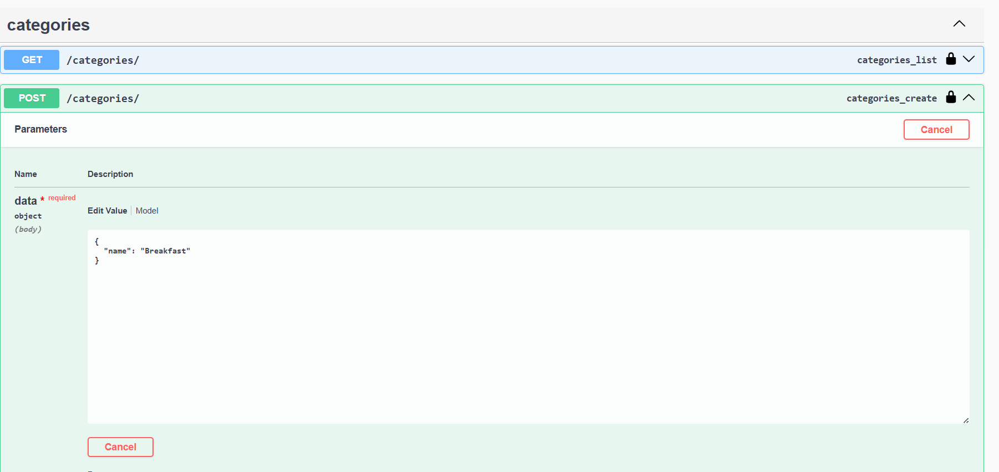
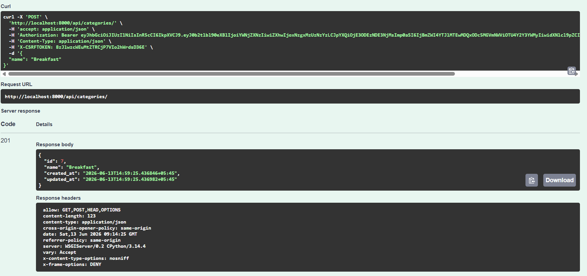
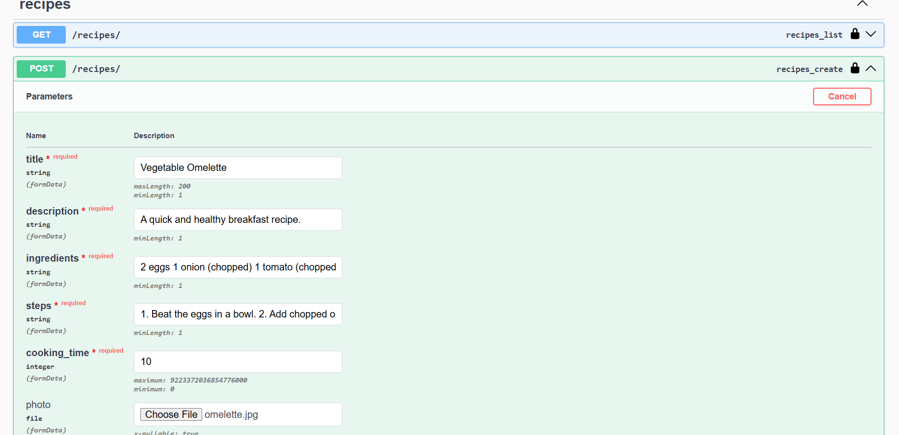
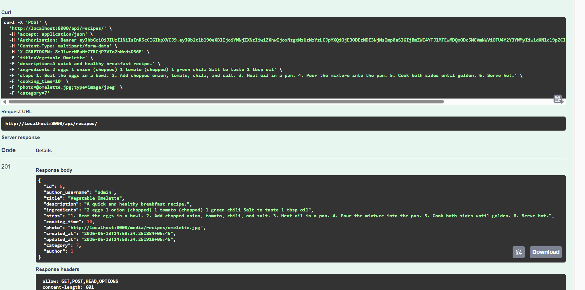


## JWT Token Generation
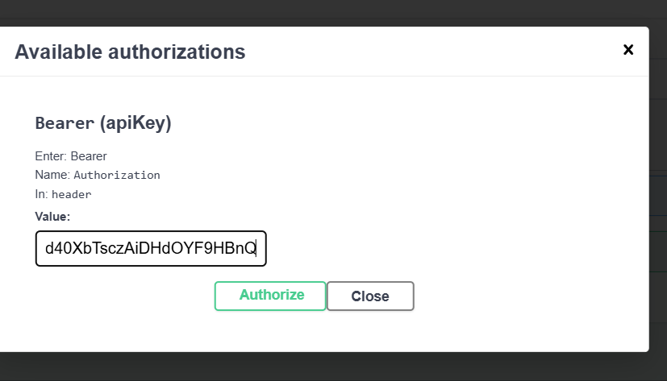
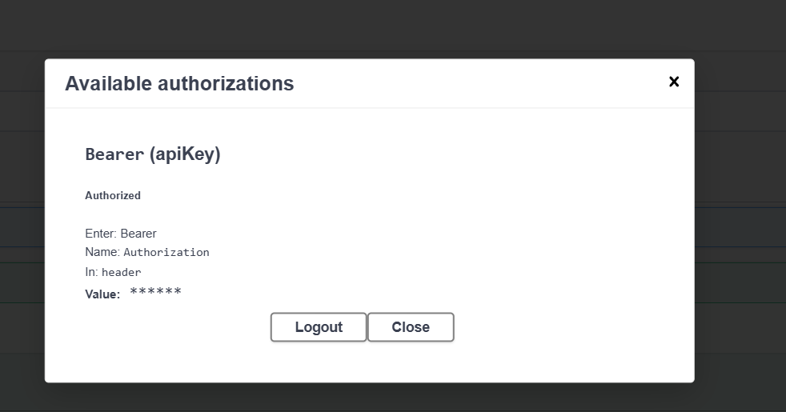


## Email Sent Successfully
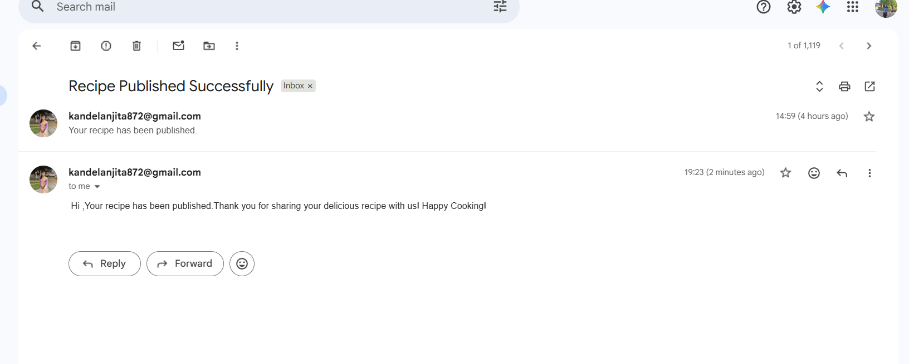


## Jazzmin Admin Panel
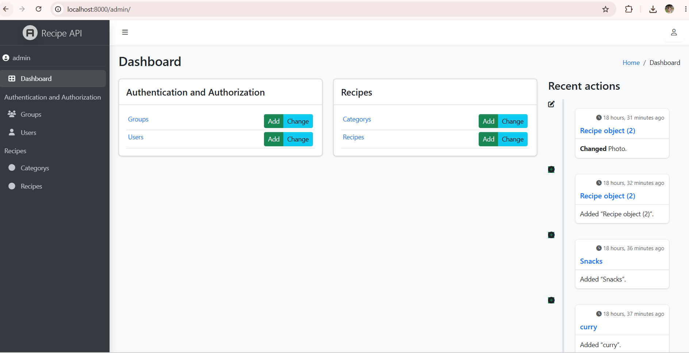
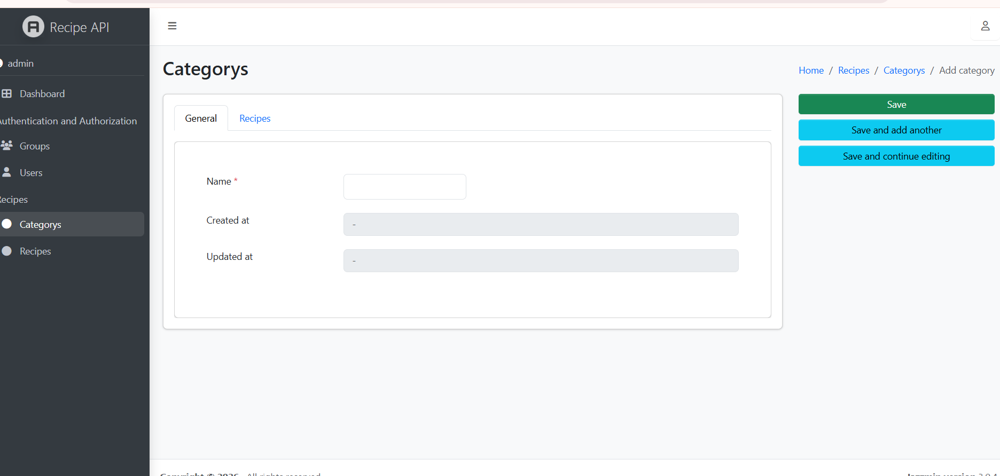
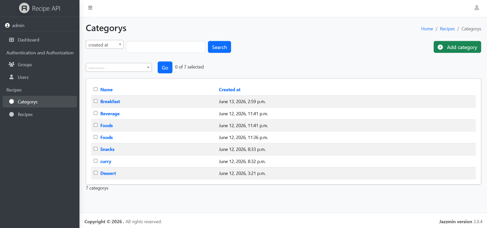
.png)


